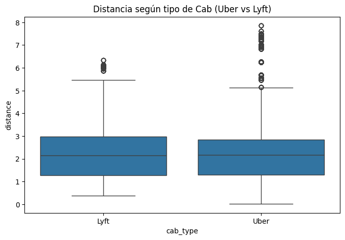
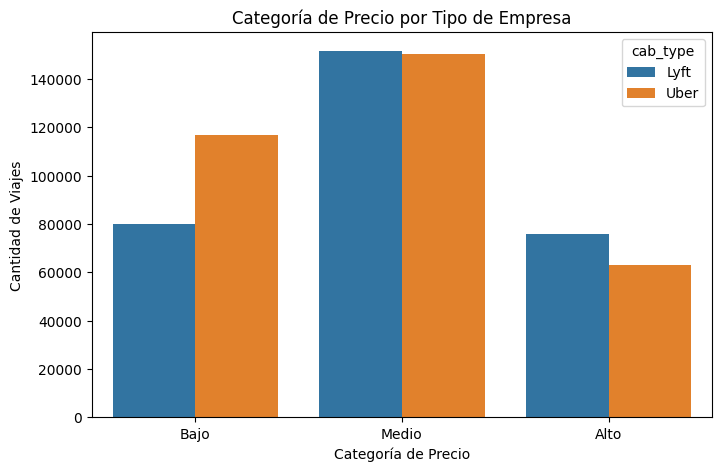
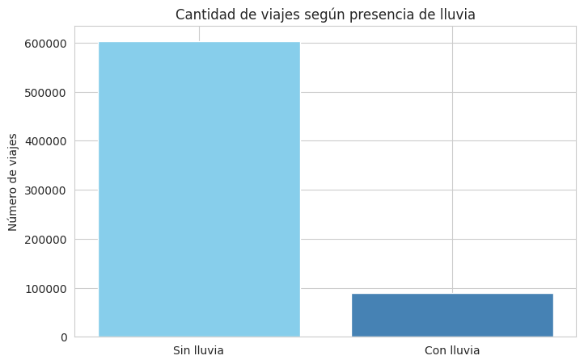
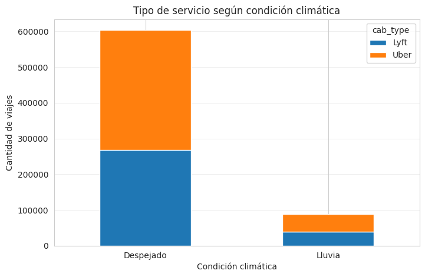
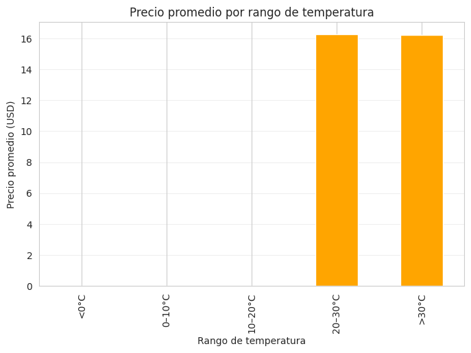
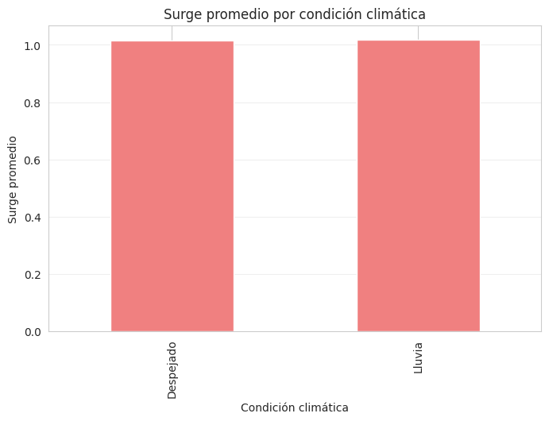
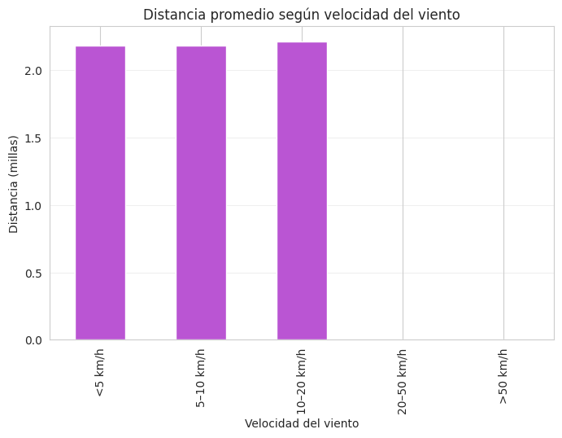
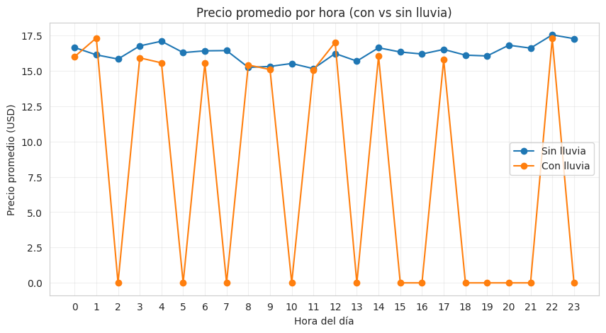

## 👥 Integrantes del grupo

- **Bonilla Alejandro Sergia**  
- **Franco Nieto Carlos**  
- **Reyes Peñafiel Fátima**  
- **Rodas Cruz Mia**
---
- ## 🎯 Objetivo
Analizar el comportamiento de precios, distancias y demanda en servicios de transporte (Uber y Lyft), considerando la influencia de las condiciones climáticas.  
El propósito es descubrir patrones, relaciones entre variables e insights que permitan comprender cómo el clima y el horario afectan el costo de los viajes.

## 🧩 1. Exploración inicial del dataset
<div align="center">


**Dataset:** 693,071 registros | **Columnas:** 10 columnas | **Estado:** ✅ Análisis Completado

</div>
Se trabajó con dos archivos:

| Dataset | Filas | Columnas | Descripción |
|----------|--------|-----------|-------------|
| `PFDA_rides.csv` | 693,071 | 10 | Información de viajes (tipo de cab, distancia, precio, hora, etc.) |
| `PFDA_weather.csv` | 6,276 | 8 | Condiciones meteorológicas (temperatura, lluvia, humedad, viento, etc.) |

**Columnas principales:**
- `distance`, `cab_type`, `time_stamp`, `price`, `surge_multiplier`
- `temp`, `rain`, `humidity`, `clouds`, `wind`
## 🧹 2. Evaluación de calidad de datos

| Aspecto | Resultado |
|----------|------------|
| Duplicados | 0 registros |
| Valores nulos | 55,095 en `price` (≈ 7.95%) |
| Outliers | Detectados en `price` |
| Limpieza sugerida | Tratar nulos en clima y ajustar valores extremos |

> 📌 El dataset tiene buena calidad general, pero requiere limpieza ligera para asegurar precisión.

## 🧮 3. Creación de nuevas variables

Se generaron **tres variables derivadas** para facilitar el análisis:

| Variable nueva | Descripción | Método |
|----------------|--------------|---------|
| `hora` | Hora del día del viaje | `dt.hour` |
| `dia_semana` | Día de la semana | `dt.day_name()` |
| `categoria_precio` | Clasificación en **Bajo**, **Medio**, **Alto** | `pd.cut(price, bins=[0,10,25,100])` |

## 📊 4. Visualizaciones principales
### 🔹 1. Distribución del Precio
📈 **Pregunta:** ¿Cómo se distribuyen los precios de los viajes?

  
> La mayoría de los viajes presentan **precios bajos**, con pocos valores extremos.
### 🔹 2. Distancia por Tipo de Cab
📊 **Pregunta:** ¿Existen diferencias de distancia entre Uber y Lyft?

  
> **Uber** tiende a cubrir **mayores distancias promedio** que **Lyft**.

### 🔹 3. Número de Viajes por Categoría de Precio y Tipo de Cab
📉 **Pregunta:** ¿Qué empresa domina cada categoría de precios?

  
> Se observa que la mayoría de los viajes de ambos servicios se concentra en la categoría Media. Esto indica que la mayor demanda se da en tarifas intermedias, aunque Uber muestra un mayor volumen relativo de viajes tanto en categorías bajas como medias, mientras que Lyft concentra menos viajes económicos.

### 🔹 4. Cantidad de viajes según presencia de lluvia
📉 **Pregunta:** ¿Cómo se distribuye la cantidad de viajes según la presencia o ausencia de lluvia?

  
> La mayoría de los viajes ocurren en días sin lluvia. Esto indica que la lluvia reduce la cantidad total de viajes, aunque todavía hay una proporción significativa de viajes en días lluviosos.

### 🔹 5. Tipo de servicio según condición climática
📉 **Pregunta:** ¿El clima influye en el tipo de servicio?

  
>  El clima afecta la demanda, con menos viajes cuando llueve, y Uber sigue teniendo más volumen que Lyft en todas las condiciones climáticas.

### 🔹 6. Precio promedio por rango de temperatura
📉 **Pregunta:** ¿Existe una relación entre el rango de temperatura y el precio promedio de los viajes?

  
>  El dataset está concentrado en días calurosos (>30 °C), con pocos viajes entre 20–30 °C y ninguno en rangos fríos (<20 °C).

### 🔹 7. Surge promedio por condición climática
📉 **Pregunta:** ¿Cómo varía el factor de precio dinámico (Surge) promedio en función de la condición climática?

  
>  Cuando llueve, la presión de demanda aumenta un poco, lo que genera un leve incremento en los precios (surge). La diferencia no es enorme pero muestra que la lluvia sí afecta el costo de los viajes.

### 🔹 8. Distancia promedio según velocidad del viento
📉 **Pregunta:** ¿La velocidad del viento afecta la distancia promedio del viaje?

  
>  En días con vientos leves o moderados, la distancia promedio de los viajes se mantiene estable.

### 🔹 9. Precio promedio por hora (con vs sin lluvia)
📉 **Pregunta:** ¿Cómo evoluciona el precio promedio de los viajes a lo largo del día, y cómo se compara esta evolución cuando hay lluvia frente a cuando no la hay?

  
>  Los precios promedio por hora son similares con o sin lluvia. Algunos aumentos se notan en horas con registros de lluvia, pero en muchas horas no hubo viajes lluviosos, por lo que el efecto de la lluvia es limitado.

### 🔹 10. Precio por kilómetro según clima
📉 **Pregunta:** ¿Cómo afecta la condición climática al costo real del viaje por unidad de distancia (precio por kilómetro)?

  
>  Los precios promedio por hora son similares con o sin lluvia. Algunos aumentos se notan en horas con registros de lluvia, pero en muchas horas no hubo viajes lluviosos, por lo que el efecto de la lluvia es limitado.

## 🔬 5. Diagnóstico General

<table>
<tr>
<td width="50%">

### 📈 Calidad de Datos

- ✅ **Estructura coherente** y bien organizada
- ⚠️ Variables climáticas con valores nulos
- 🎯 Outliers detectados en precios/distancias
- 🔗 Datasets unidos por índice

</td>
<td width="50%">

### 💡 Insights Clave

```
🔹 Diferencias claras entre plataformas
🔹 Patrones horarios identificados
🔹 Influencia climática observable
🔹 Variabilidad en distancias
```

</td>
</tr>
</table>

## 📊 6. Pipeline de Análisis


## 🧠 7. Propuestas de análisis futuras

| Nº | Tema de análisis | Pregunta de investigación |
|----|------------------|---------------------------|
| 1️⃣ | Clima vs Precio | ¿Suben los precios cuando llueve o hace frío? |
| 2️⃣ | Demanda vs Hora | ¿Las horas pico incrementan significativamente el precio? |

## 🎯 8. Principales hallazgos

<table>
<tr>
<td width="33%" align="center">

<h3>Precios</h3>
<p>Variabilidad significativa entre plataformas y horarios</p>
</td>
<td width="33%" align="center">

<h3>Clima</h3>
<p>Correlación observable con tarifas dinámicas</p>
</td>
<td width="33%" align="center">

<h3>Horarios</h3>
<p>Patrones de demanda claramente diferenciados</p>
</td>
</tr>
</table>

## ✅ 9. Conclusión general
El análisis muestra que el clima sí influye en los viajes compartidos, aunque de manera moderada. En días de lluvia, la cantidad total de viajes disminuye, pero el surge y la elección de tipo de servicio reflejan una mayor presión de demanda y preferencia por cabs más cómodos. Los precios por kilómetro no aumentan significativamente en lluvia, y las distancias promedio tienden a ser más cortas en condiciones extremas de viento. Además, el dataset está sesgado hacia días calurosos, lo que limita el análisis de temperaturas bajas. Por lo que, el clima afecta la demanda y ciertos patrones de viaje, pero su impacto sobre los precios por kilómetro es limitado.


